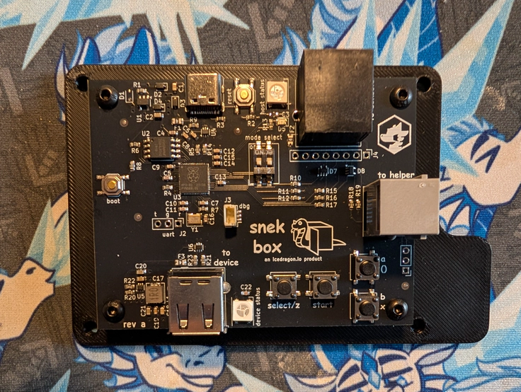

# snekbox: USB to Retro Console Adapter

Snekbox is a new USB to retro console adapter made specifically for high speed rhythm game use. It allows you to use new high quality USB rhythm and USB game controllers with older retro consoles such as the PlayStation, PlayStation 2, Original Xbox, GameCube, and Wii.

<p align="center">

</p>

# [click here to learn more and purchase!](https://icedragon.io/snek-box)

# adding new devices
New device requests are always welcome! Please make an issue ticket with a detailed report about the device you wish to add.

Please include as much information as possible including the USB VID/PID, the HID Report, and the button assignments.

If you have a new device working, feel free to submit a PR!

# flashing
Put the rp2040 into bootloader mode by connecting the type c port to your computer, holding the boot button, then pressing the reset button.

There should now be flash drive you can drag the UF2 firmware file to.

# building
Ensure the rp2040 sdk is successfully installed and is available under `PICO_SDK_PATH`.

```
mkdir build
cd build
cmake ../
make all -j$(nproc)
```

# supported target consoles
* Playstation 1/2
* GameCube/Wii
* Original Xbox

# supported host devices
* icedragon.io STAC
* icedragon.io Snek Board
* StepManiaX
* LTEK
* Gamo2 PHOENIXWAN
* RedOctane X-Plorer
* DFORCE Softmat
* DanceDanceRevolution Classic Mini
* DualShock 3/4
* DualSense
* Switch Pro
* Xbox One (wired)
* Xbox 360 (wired)
* Xbox 360 USB Wireless adapter

# libraries and reference:
* [tinyusb](https://github.com/hathach/tinyusb)
* [Pico-PIO-USB](https://github.com/sekigon-gonnoc/Pico-PIO-USB)
* [pico_i2c_slave](https://github.com/vmilea/pico_i2c_slave)
* [pico-joybus-comms](https://github.com/JulienBernard3383279/pico-joybus-comms)
* [DS4toPS2](https://github.com/TonyMacDonald1995/DS4toPS2)
* [tusb_xinput](https://github.com/Ryzee119/tusb_xinput)
* [ogx360](https://github.com/Ryzee119/ogx360)